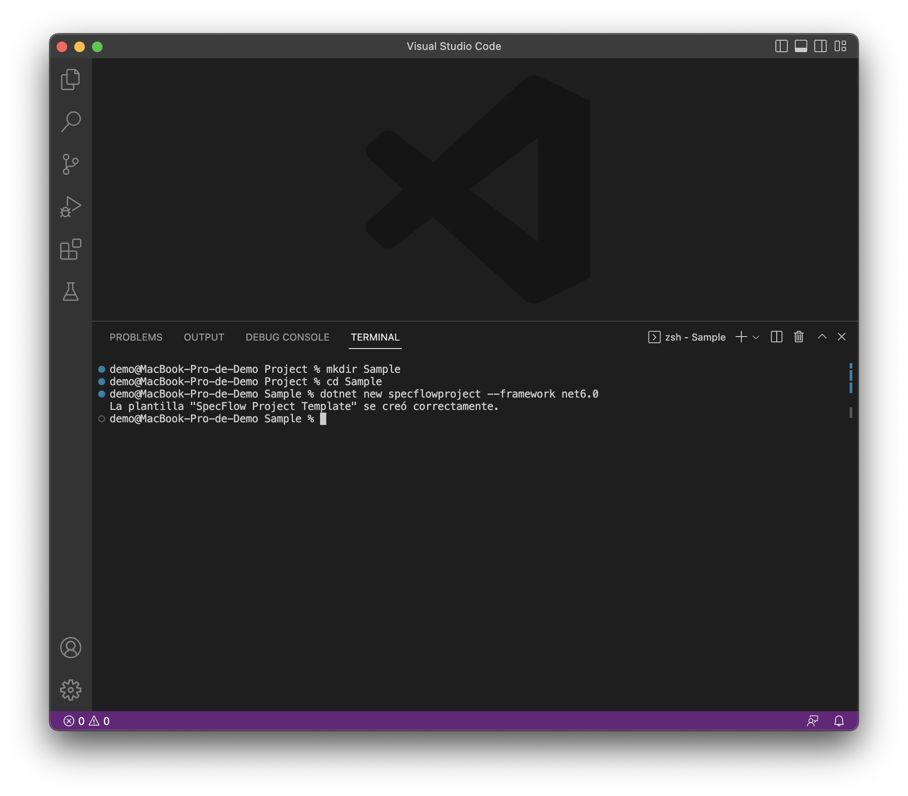
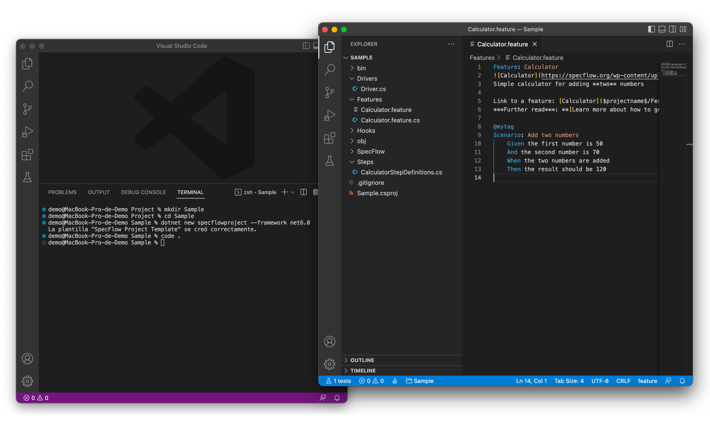

Setting up Cucumber for .NET in Visual Studio Code
=====================================================

Installation
------------

1.  Download and install Visual Studio Code ([Linux](https://code.visualstudio.com/docs/setup/linux) , [macOS](https://code.visualstudio.com/docs/setup/mac) and [Windows](https://code.visualstudio.com/docs/setup/windos)).
2.  Download and install .NET SDK 6.0 and .NET SDK 8.0 ([Linux, Windows, macOS](https://dotnet.microsoft.com/download/dotnet/6.0)).
3.  Install following extensions in Visual Studio Code:  
    \- C#.
    \- C# Dev Kit.
    \- C# Extensions.
    \- .NET Core Test Explorer.
    \- .NET Core Tools.
    \- .NET Install Tools.  
    \- Cucumber.  
    \- Cucumber (Gherkin) Full Support.  
    \- Nuget Gallery.  
    \- Reqnroll/SpecFlow Steps Definition Generator.  
    \- SpecFlow Tools.  
      
    
    
5.  Download and install SpecFlow Template in Visual Studio Code from NuGet.org:  
      
    dotnet new --install SpecFlow.Templates.DotNet  
      
    
    
    
Create a Sample Project
-----------------------

1.  Create a sample Visual Studio Code project using the "specflowproject" template and .NET 6.0:
    
   
    mkdir Sample
    
    cd Sample
    
    dotnet new specflowproject --framework net6.0
    
    
    
 2. Open sample project:
 
    code .
    
    
    
